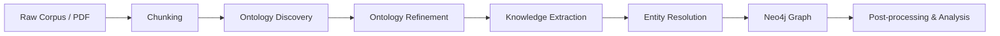
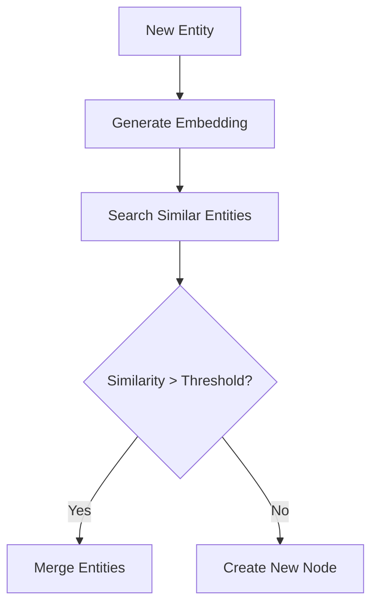

# 🚀 LLM-Driven Knowledge Graph Pipeline

### Ontology Engineering • Knowledge Extraction • Entity Resolution

An end-to-end experimental pipeline for constructing high-quality Knowledge Graphs (KGs) using lightweight and efficient LLMs with dynamic memory handling, ontology discovery, and Neo4j-based entity resolution.

---

# 📌 Motivation

Building Knowledge Graphs from large corpora using LLMs introduces several critical challenges:

* ❗ Context window limitations
* ❗ Duplicate entity creation
* ❗ Weak ontology consistency
* ❗ Lack of dynamic memory across chunks

This project explores a modular, research-oriented pipeline designed to address these issues through:

* ✅ Ontology Engineering with LLMs
* ✅ Structured Knowledge Extraction
* ✅ Vector-based Entity Resolution
* ✅ Neo4j Graph Storage
* ✅ Dynamic Memory Strategies

---

# 🧠 High-Level Pipeline



---

# 🏗️ Project Architecture

```bash
.
├── ontology_extractor.py        # Ontology discovery & refinement
├── kg_llm_extractor.py          # LLM-based knowledge extraction
├── neo4j_entity_resolution.py   # Vector-based entity deduplication
├── .env                         # Neo4j credentials
└── README.md
```

---

# 🔬 Core Components

## 1️⃣ Ontology Engineering

**File:** `ontology_extractor.py`

### 🎯 Goal

Automatically discover and refine the schema before Knowledge Graph construction.

### 🧩 Approach

#### Phase 1 — Ontology Discovery

The LLM analyzes corpus chunks to identify:

* Candidate entity types
* Relationship types
* Attribute patterns
* Domain concepts

#### Phase 2 — Ontology Refinement

The discovered ontology is:

* Deduplicated
* Normalized
* Structured into a consistent schema
* Validated for conflicts

### ✅ Why This Matters

Without ontology grounding:

* KG becomes noisy
* Relations become inconsistent
* Downstream reasoning fails

This stage provides schema stability before extraction.

---

## 2️⃣ Knowledge Extraction

**File:** `kg_llm_extractor.py`

### 🎯 Goal

Transform unstructured text into structured triples.

### ⚙️ Extraction Strategy

For each chunk:

1. Pass chunk to a small LLM
2. Extract structured triples
3. Attach metadata (`chunk_id`, confidence, etc.)
4. Store intermediate results

### 🧱 Output Format

```json
{
  "entities": [...],
  "relationships": [...],
  "source_chunk": "...",
  "confidence": 0.xx
}
```

### 🔑 Key Design Decisions

#### ✅ Chunk-aware extraction

Each triple retains provenance.

#### ✅ Schema-guided prompting

Extraction is constrained by the discovered ontology.

#### ✅ Small-model friendly

Designed to run efficiently with lightweight models such as Mistral-7B.

---

## 3️⃣ Entity Resolution (Deduplication)

**File:** `neo4j_entity_resolution.py`

This is one of the most critical components of the pipeline.

### 🚨 Problem

When processing chunks independently:

* The same entity appears multiple times
* The graph becomes fragmented
* Query quality degrades

### 💡 Solution

The pipeline implements vector-based entity resolution using:

* Sentence embeddings
* Similarity search
* Neo4j vector index
* Threshold-based merging

### 🔄 Resolution Flow



### 🧠 Matching Strategy

Comparison is performed using:

* Name similarity
* Semantic embedding similarity
* Optional attribute matching

This significantly reduces duplicate nodes.

---

# 🧩 Dynamic Memory Strategy

One major challenge during development was:

> ❓ How do we prevent the LLM from "forgetting" previous chunks?

## ❌ Naive Approach

Processing chunks independently leads to:

* Duplicate entities
* Inconsistent relations
* Ontology drift

## ✅ Hybrid Solution

The pipeline combines:

### 🔹 Pre-Extraction Memory

* Ontology grounding
* Schema constraints

### 🔹 Post-Extraction Memory

* Entity resolution
* Graph merging
* Community clustering

## 🚀 Why This Works Better

Instead of forcing the LLM to remember everything — which is expensive and unreliable — the pipeline:

* ✔ Lets the model work locally
* ✔ Fixes globally through graph algorithms
* ✔ Maintains scalability

---

# 🗄️ Neo4j Integration

The graph layer provides:

* Persistent memory
* Efficient traversal
* Vector similarity search
* Graph analytics

---

# 🔧 Required Environment Variables

Create a `.env` file:

```env
NEO4J_URI=bolt://localhost:7687
NEO4J_USERNAME=neo4j
NEO4J_PASSWORD=your_password
```

---

# ▶️ How to Run

## 1️⃣ Install Dependencies

```bash
pip install -r requirements.txt
```

## 2️⃣ Start Neo4j

Ensure Neo4j is running locally.

## 3️⃣ Run Ontology Discovery

```bash
python ontology_extractor.py
```

## 4️⃣ Run Knowledge Extraction

```bash
python kg_llm_extractor.py
```

## 5️⃣ Run Entity Resolution

```bash
python neo4j_entity_resolution.py
```

---

# 📊 Design Philosophy

This project follows several key principles.

## 🧠 LLMs are not memory systems

Instead of overloading context windows, the pipeline relies on:

* Graph memory
* Vector search
* Post-processing

## ⚡ Small models > giant models (for pipelines)

The system is optimized for:

* Mistral-7B class models
* Kaggle and consumer GPUs
* Efficient inference

## 🔄 Graph post-processing is essential

High-quality Knowledge Graphs require:

* Deduplication
* Clustering
* Schema enforcement

—not just extraction.

---

# 🧪 Future Work

* Online ontology adaptation
* Streaming KG construction
* Community detection integration
* Temporal knowledge graphs
* Multi-agent extraction
* GraphRAG integration

---

# 🤝 Contributions

Contributions, ideas, and research discussions are welcome.

If you are working on:

* KG construction
* GraphRAG
* Ontology learning
* LLM pipelines

feel free to open an issue or submit a PR.

---

# ⭐ Acknowledgment

This project is an experimental research effort exploring the intersection of:

* Knowledge Graphs
* Small Language Models
* Graph Databases
* Representation Learning

---

# 💬 Author Note

Building robust Knowledge Graphs with LLMs is not just an extraction problem —
it is a systems engineering problem involving memory, ontology, and graph intelligence.
